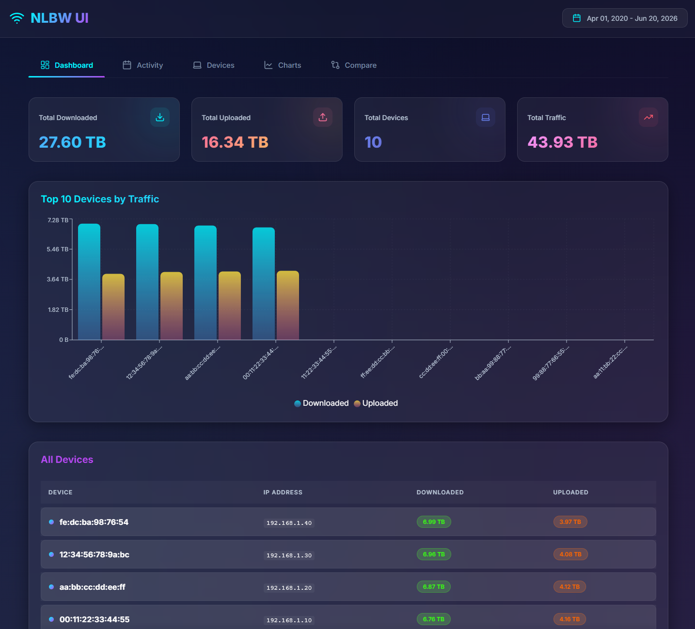
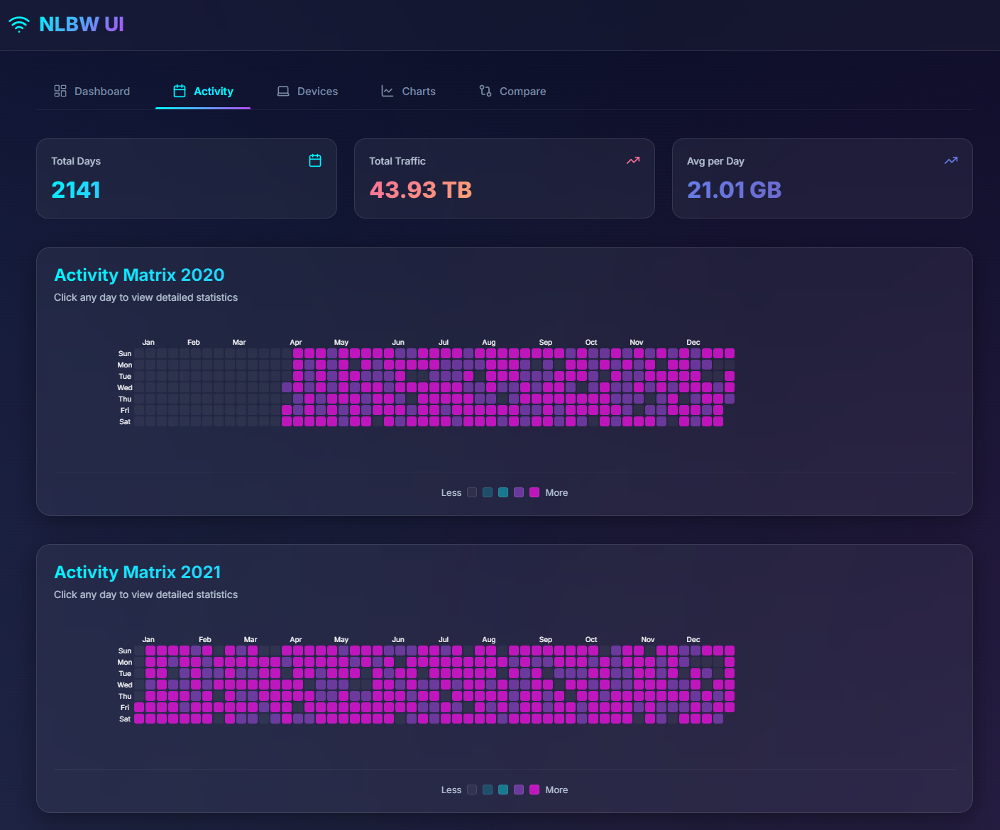
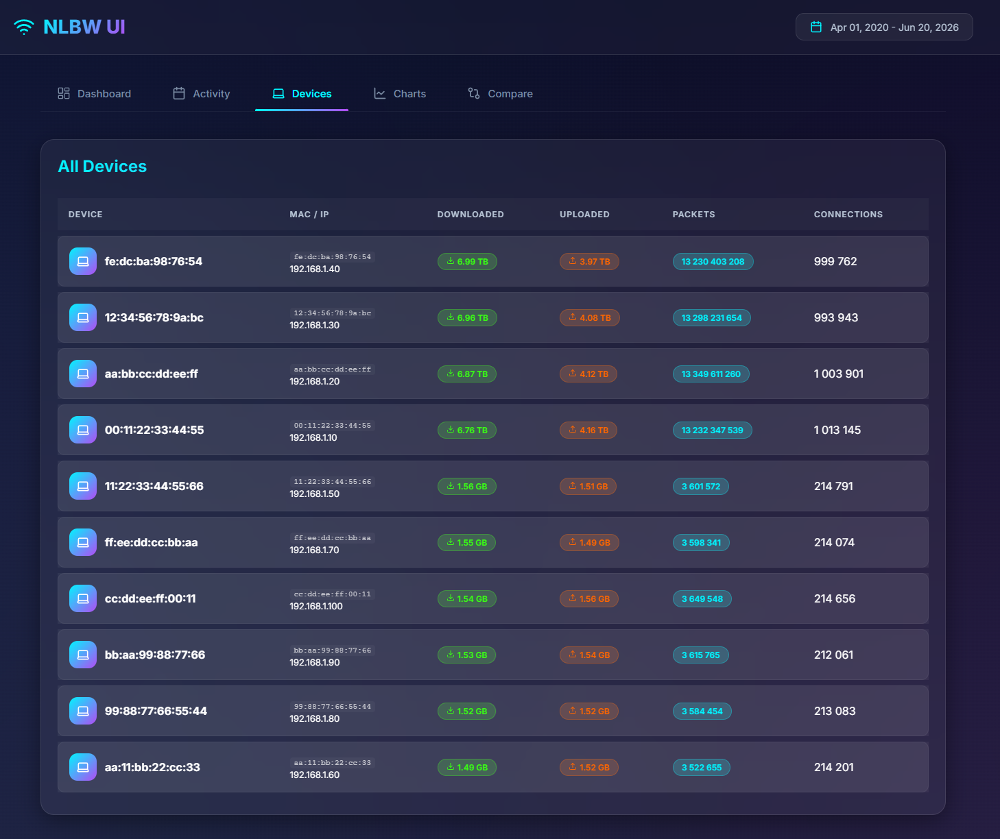
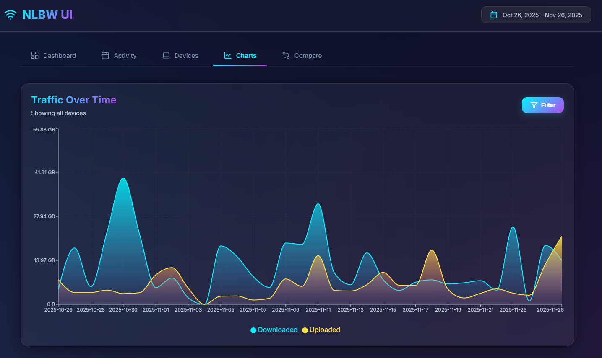
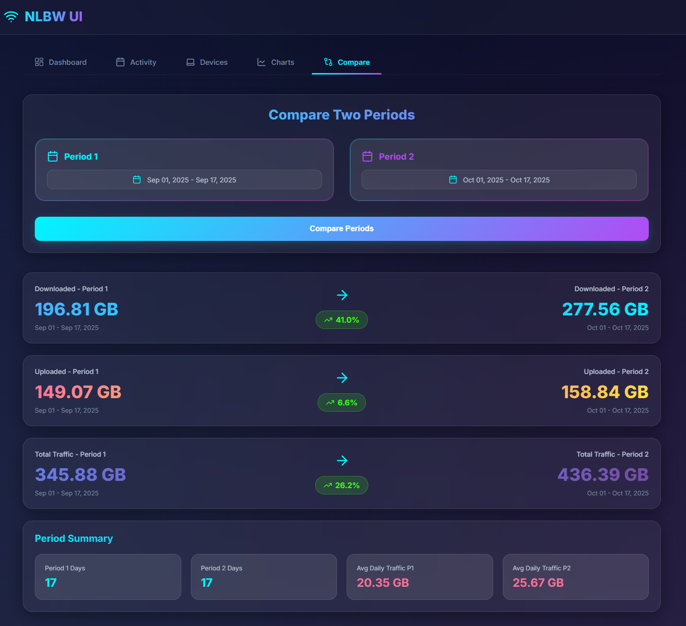

# NLBW-UI

Modern web application for monitoring and visualizing network traffic from nlbwmon (*.db.gz files).

## Features

- **Modern Web Interface**: React + Ant Design with dark theme
- **Real-time Monitoring**: Automatic scanning of data directory
- **Rich Visualizations**: Charts, heatmaps, and detailed analytics
- **Embedded Frontend**: Single binary with built-in web UI
- **REST API**: Full API for data access
- **No External Dependencies**: Single executable + config file

## Screenshots

### Dashboard
Overview with total statistics and top devices



### Activity Matrix
GitHub-style heatmap showing traffic patterns



### Devices
Detailed per-device breakdown with protocol analysis



### Charts
Time-series graphs with device filtering



### Comparison
Compare traffic between different time periods



## Requirements

- **Go** 1.21+ (for building)
- **Node.js** 18+ and npm (for building frontend)
- **nlbwmon** data files (*.db.gz format)

## Quick Start

### 1. Build the project

```bash
# Install frontend dependencies
cd frontend
npm install
cd ..

# Build frontend
cd frontend
npm run build
cd ..

# Build backend
go build -o nlbw-ui .
```

Or use Make:

```bash
make install  # Install npm dependencies
make build    # Build everything
```

### 2. Run

```bash
./nlbw-ui
```

On first run, the application will:
1. Create `config.yaml` with default settings
2. Start scanning for *.db.gz files
3. Launch web server on http://localhost:8080

### 3. Configure

Edit `config.yaml`:

```yaml
# Directory containing *.db.gz files
data_dir: ./data

# How often to scan for new/modified files
scan_interval: 10s

# Web server settings
server_address: 0.0.0.0
server_port: 8080

# Optional: Friendly names for devices
friendly_names:
  "4a:bd:24:cf:07:5d": "iPhone 13"
  "bc:24:11:72:be:55": "MacBook Pro"
  "ea:fa:e9:d2:67:f4": "iPad Air"
```

### 4. Access the UI

Open your browser and navigate to: **http://localhost:8080**

## Configuration Options

### Required Settings

- `data_dir`: Path to directory containing nlbwmon *.db.gz files
- `scan_interval`: How often to check for file changes (e.g., 5s, 1m, 5m)
- `server_address`: IP address to bind to (0.0.0.0 for all interfaces)
- `server_port`: TCP port for web server

### Optional Settings

- `friendly_names`: Map MAC addresses to readable device names
  ```yaml
  friendly_names:
    "aa:bb:cc:dd:ee:ff": "My Device"
  ```

## Web Interface

The web interface provides five main views:

### 1. Dashboard
- Total download/upload statistics
- Top 10 devices by traffic
- Device list with sortable columns
- Date range selector

### 2. Activity Matrix
- GitHub-style heatmap visualization
- Shows traffic patterns over time
- Click any day to view details
- Grouped by year

### 3. Devices
- Complete device list
- Click device for protocol breakdown
- Charts showing protocol distribution
- Download vs upload comparison

### 4. Charts
- Time-series area charts
- Filter by specific devices
- Shows traffic trends over time
- Configurable date ranges

### 5. Comparison
- Compare two time periods
- Side-by-side statistics
- Percentage change calculations
- Identify usage trends

## API Endpoints

### Calendar Data
```
GET /api/calendar
```
Returns all available dates with traffic totals for heatmap visualization.

### Summary Statistics
```
GET /api/summary?from=YYYY-MM-DD&to=YYYY-MM-DD
```
Aggregated statistics for the specified date range.

### Daily Details
```
GET /api/day/YYYY-MM-DD
```
Device-level breakdown for a specific day.

### Device Protocols
```
GET /api/device/YYYY-MM-DD/MAC
```
Protocol-level breakdown for a specific device and date.

### Time Series
```
GET /api/timeseries?from=YYYY-MM-DD&to=YYYY-MM-DD&macs=MAC1,MAC2
```
Time-series data for charts, optionally filtered by device.

## Architecture

### Backend (Go)

Clean architecture with modular packages:

- **config**: Configuration loading and validation
- **converter**: Parse nlbwmon .db.gz files
- **scanner**: Watch directory for file changes (SHA256 hashing)
- **cache**: In-memory data storage
- **aggregator**: Aggregate statistics across dates/devices
- **api**: HTTP server and REST endpoints

### Frontend (React)

Modern SPA built with:

- **React 18.3**: Latest React with hooks
- **Vite 6.0**: Fast build tooling
- **Ant Design 5.22**: Professional UI components
- **Recharts 2.13**: Beautiful charts
- **@uiw/react-heat-map 2.2**: GitHub-style heatmap
- **dayjs 1.11**: Date manipulation

### Integration

Frontend is embedded in the Go binary using `//go:embed` - no need for separate web server.

## Development

### Dev Mode with Hot Reload

Terminal 1 - Backend:
```bash
go run main.go
```

Terminal 2 - Frontend:
```bash
cd frontend
npm run dev
```

Frontend will be available at http://localhost:3000 with API proxy to backend.

### Make Commands

```bash
make help      # Show all commands
make install   # Install npm dependencies
make frontend  # Build React app
make backend   # Build Go server
make build     # Build everything
make run       # Run the server
make dev       # Run frontend in dev mode
make clean     # Remove build artifacts
```

## Production Deployment

### Build

```bash
make build
```

This creates a single `nlbw-ui` binary (~9-10 MB) with embedded frontend.

### Copy to Server

```bash
scp nlbw-ui user@server:/opt/nlbw-ui/
```

### Configure

On the server, create `config.yaml`:

```yaml
data_dir: /var/lib/nlbwmon
scan_interval: 30s
server_address: 0.0.0.0
server_port: 8080

friendly_names:
  "aa:bb:cc:dd:ee:ff": "Router"
  "11:22:33:44:55:66": "Server"
```

### Run as systemd Service

Create `/etc/systemd/system/nlbw-ui.service`:

```ini
[Unit]
Description=NLBW-UI
After=network.target

[Service]
Type=simple
User=nlbw
WorkingDirectory=/opt/nlbw-ui
ExecStart=/opt/nlbw-ui/nlbw-ui
Restart=always
RestartSec=10

[Install]
WantedBy=multi-user.target
```

Enable and start:

```bash
sudo systemctl daemon-reload
sudo systemctl enable nlbw-ui
sudo systemctl start nlbw-ui
sudo systemctl status nlbw-ui
```

## Troubleshooting

### Port Already in Use

Change `server_port` in `config.yaml` to an available port.

### Files Not Detected

1. Verify `data_dir` points to correct directory
2. Ensure files have `.db.gz` extension
3. Check file permissions

### Frontend Not Loading

Ensure frontend was built:
```bash
cd frontend
npm run build
cd ..
go build -o nlbw-ui .
```

Verify `frontend/dist/` directory exists and contains files.

### High Memory Usage

The application caches all data in memory for fast access. Memory usage scales linearly with the amount of data:

| Data Period | Days | RAM Usage (RSS) |
|-------------|------|-----------------|
| 1 day       | 1    | 7.5 MB          |
| 30 days     | 31   | 8 MB            |
| 1 year      | 365  | 13.25 MB        |
| 5 years     | 1826 | 35 MB           |
| 20 years    | 7305 | 113.75 MB       |

**Average consumption**: ~15.6 KB per day of data

Memory usage depends on:
- Number of days with *.db.gz files
- Number of devices per day
- Amount of traffic data per device

The application demonstrates excellent scalability - even 20 years of data (7305 days) consumes only ~114 MB of RAM.

To reduce memory usage, archive old files to a different directory.

## Technology Stack

### Backend
- Go 1.21+
- Standard library (net/http, embed)
- gopkg.in/yaml.v3 (YAML parsing)

### Frontend
- React 18.3
- Vite 6.0
- Ant Design 5.22
- Recharts 2.13
- @uiw/react-heat-map 2.2
- dayjs 1.11

## Project Structure

```
nlbw-ui/
├── main.go                 # Entry point
├── config.yaml             # Configuration (created on first run)
├── go.mod                  # Go dependencies
├── go.sum                  # Go dependency checksums
├── Makefile                # Build automation
├── internal/               # Backend packages
│   ├── config/            # Configuration loading
│   ├── converter/         # Parse .db.gz files
│   ├── scanner/           # File watching
│   ├── cache/             # In-memory storage
│   ├── aggregator/        # Data aggregation
│   └── api/               # HTTP server
└── frontend/              # React SPA
    ├── src/
    │   ├── components/    # React components
    │   ├── utils/         # Utility functions
    │   ├── App.jsx        # Main app component
    │   └── main.jsx       # Entry point
    ├── package.json       # npm dependencies
    ├── vite.config.js     # Vite configuration
    └── dist/              # Built frontend (embedded)
```

## License

ISC License (compatible with nlbwmon)

## Credits

Built on top of nlbwmon by Jo-Philipp Wich
